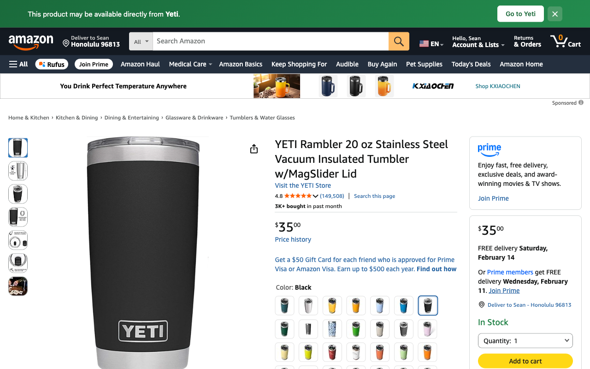

# NoPrime

A Chrome extension that displays links to the manufacturer's store on Amazon product pages.

This extension works entirely offline with a bundled brand database to avoid privacy concerns.



## Usage

Install the latest official build from the [Chrome Web Store](https://chromewebstore.google.com/detail/hbcfjgcckbhkikejdcjigmkkegjbjfao).

## Project structure

```
NoPrime/
├── extension/              # ← Load this folder in chrome://extensions
│   ├── manifest.json       # Chrome MV3 manifest
│   ├── icons/              # Extension icons (16/48/128, normal + disabled)
│   └── src/
│       ├── background.js   # Service worker – toggle, badge, per-tab state
│       ├── banner.css      # Injected banner styles (green/orange/gray)
│       ├── brands.js       # Brand → store mapping, aliases, suspect detection
│       ├── content.js      # Content script – banner injection & toggle
│       └── extractor.js    # DOM scraping for brand, title, book/ISBN detection
├── tests/
│   ├── extension_test.js   # E2E Playwright tests (book/brand/fallback/suspect)
│   └── brands_test.js      # Brand URL reachability validator
├── bundle.sh               # Builds extension .zip for Chrome Web Store
├── create-icons.js         # Generates icon PNGs from logo.svg
└── README.md
```

## Installation (development)

1. Open `chrome://extensions` in Chrome
2. Enable **Developer mode** (toggle in the top-right)
3. Click **Load unpacked** and select the `NoPrime/extension/` folder
4. Navigate to any Amazon product page — you should see a green banner

## Expanding the brand database

The brand database lives in `extension/src/brands.js`. Each entry maps a lowercase brand name to:

```js
"brand-name": { url: "https://www.brand.com", searchTemplate: "https://www.brand.com/search?q={query}" }
```

## License

MIT
